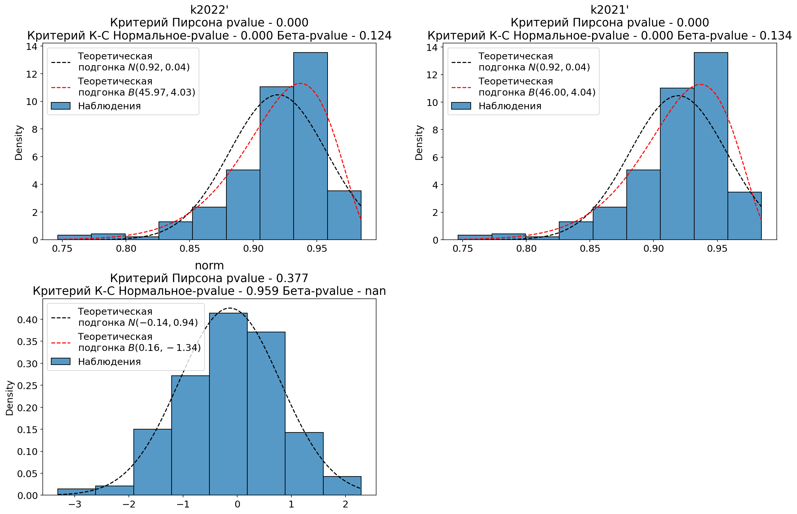

## Программа для проверки критериев согласия из excel

### Установка

Программа разработана под python 3.11.3

Устанавливаем необходимые библиотеки перечисленные в файле requirements.txt
```
pip install -r requirements.txt
```

## Описание файлов

### **distrib_test.py**

Файл с функциями для проверки нормальности по критерию Пирсона и Лилиефорса и соответствия выборки бета-распределению по критерию Колмогорова-Смирнова.

**class PDFNormal** - Класс для работы с подгонкой под нормальной распределение:
    
* *@staticmethod estimate_params(data)* - возвращает точечную оценку математического ожидания и среднеквадратичного отклонения;

* *pdf(self, x)* - возвращает значение плотности вероятности в точке x для подгонки.

**class PDFBeta** - Класс для работы с подгонкой под бета-распределение:
* *@staticmethod estimate_params(data)* - возвращает точечные оценки параметров бета-распределения, полученные через точечные оценки математического и дисперсии;
* *pdf(self, x)* - возвращает значение плотности вероятности в точке x для подгонки.

**class DataContainer** - класс для хранения выборки и полученных pvalue по различным критериям согласия:
* *testHypotheses(self, normal: PDFNormal, beta: PDFBeta) -> None* - проверка гипотезы о соответствии выборки нормальному распределению по критерию Пирсона и критерию Лилиефорса, проверка гипотезы о соответствии выборки бета-распределению по критерию Колмогорова-Смирнова. Сохранение значений pvalue в объекте класса;
* *pvals_info(self, label: str)* - формирование строки для печати информации о результатах критериев согласия.

*plot_fit(data, title="", isSubplot=False)* - Строит диаграмму накопленных частот для выборки *data*, подогнанное теоретическое нормальное и бета распределения и ожидаемую нормальную диаграмму накопленных частот.
- Возвращает объект класса **DataContainer** с результатами проверки критериев согласия.
- Дополнительные параметры: 
    - *title* - Текст, который будет добавлен в заголовок графика;
    - *isSubplot* - Если True, то функция не вызывает *plt.plot()*. Используется для построения нескольких графиков на одном.

### **test.py**

Скрипт для проверки работы критерия Пирсона и критерия Лилиефорса (в программе Колмогорова-Смирнова) на нескольких типовых распределениях. Каждый опыт проводится 100 раз.

**Пример работы программы**

```
$ python test.py
1. Нормальные распределения. Объём выборки 100
Критерий Пирсона:                  95/100 раз критерий выполняется
Критерий Колмогорова-Смирнова:     95/100 раз критерий выполняется

2. Экспоненциальные распределения. Объём выборки 100
Критерий Пирсона:                  0/100 раз критерий выполняется
Критерий Колмогорова-Смирнова:     0/100 раз критерий выполняется

3. Экспоненциальные распределения. Объём выборки 1000
Критерий Пирсона:                  0/100 раз критерий выполняется
Критерий Колмогорова-Смирнова:     0/100 раз критерий выполняется

4. Равномерные распределения. Объём выборки 100
Критерий Пирсона:                  0/100 раз критерий выполняется
Критерий Колмогорова-Смирнова:     0/100 раз критерий выполняется

5. Равномерные распределения. Объём выборки 1000
Критерий Пирсона:                  0/100 раз критерий выполняется
Критерий Колмогорова-Смирнова:     0/100 раз критерий выполняется

6. Распределение Коши. Объём выборки 100
Критерий Пирсона:                  0/100 раз критерий выполняется
Критерий Колмогорова-Смирнова:     0/100 раз критерий выполняется
```

### **excel_worker.py**

Содержит два сценария для работы:

**Первый сценарий.** Программа для проверки нормальности и соответствия бета-распределению выборок, записанных в Excel файле. Данные для проверки на листе располагаются в левой верхней части листа. Первая строка используется для названий выборок. Каждая выборка располагается в одном столбце.

Протокол с результатами проверки гипотез выводится в консоль. Построенные графики с этими же результатами сохраняются в папке png/<дата и время>.

**Второй сценарий.** Программа для расчёта квантиля $q_p$ с заданным уровнем вероятности $p$ бета-распределения $B(\alpha, \beta)$. Данные берутся из заданного эксель файла. 

---

Для случайной величины с бета-распределением $X\sim B(\alpha, \beta)$ Плотность распределения:

$$f_X(x) = \frac{1}{B(\alpha, \beta)}\cdot x^{\alpha-1}(1-x)^{\beta - 1},\; где\,B(\alpha, \beta) = \int_0^1 x^{\alpha - 1}(1-x)^{\beta-1}dx$$

Параметры бета-распределения можно расчитать через мат. ожидание $m_x$ и дисперсию $\sigma_x^2$:

$$\alpha = -\frac{m_x(m_x^2 - m_x + \sigma_x^2)}{\sigma_x^2},\;\beta=\frac{(m_x-1)(m_x^2 - m_x + \sigma_x^2)}{\sigma_x^2}$$

Квантиль заданной вероятности находится из:

$$p = P[x<q_p] = \int_0^{q_p} f_X(x)dx = \frac{B_{q_p}(\alpha, \beta)}{B(\alpha, \beta)} = I_{q_p}(\alpha, \beta) \Rightarrow q_p = I^{-1}_p(\alpha, \beta)$$

---

Данная программа принимает значения математического ожидания и дисперсии из файла Excel, а также уровня вероятности $p$ от пользователя, расчитывает значения параметров $\alpha,\,\beta$ для бета-распределения и проводит расчёт $q_p = I_{q_p}^{-1}(\alpha, \beta)$ (обратной регуляризованной бета-функции). 

Формат данных в таблице Excel: первая строка выделяется под названия столбцов. Названия столбцов могут быть произвольными. Программа работает с первыми 3 найденными столбцами, считая, что 1 столбец $-$ пользовательское название, 2 столбец $-$ значение математического ожидания, 3 столбец $-$ значение дисперсии.


**Пример работы программы по первому сценарию**


```
$ python excel_worker.py
Выберите решаемую задачу:
1 - проверка гипотез о нормальном и бета распределениях
2 - расчёт квантилей для бета-распределения.
1
Введите название (или путь) файла Excel с данными: data.xlsm
Открываем файл data.xlsm
Найдены следующие листы: Проверка нормальности; Лист1; Лист2
Введите название листа, откуда брать данные: Проверка нормальности
Выбран лист Проверка нормальности

Парсим данные
Найдены следующие столбцы: k k2021 k2022 k2023 k2022' k2021' norm
Строим графики. Если pvalue > 0.05, значит критерий согласия выполняется
1 график из 2
k                              Критерий Пирсона: 0.000    Критерий К-С Нормальное распр.: 0.000    Критерий К-С Бета-распр.: 0.000    
k2021                          Критерий Пирсона: 0.000    Критерий К-С Нормальное распр.: 0.000    Критерий К-С Бета-распр.: 0.094    
k2022                          Критерий Пирсона: 0.000    Критерий К-С Нормальное распр.: 0.000    Критерий К-С Бета-распр.: 0.100    
k2023                          Критерий Пирсона: 0.000    Критерий К-С Нормальное распр.: 0.000    Критерий К-С Бета-распр.: 0.099    
2 график из 2
k2022'                         Критерий Пирсона: 0.000    Критерий К-С Нормальное распр.: 0.000    Критерий К-С Бета-распр.: 0.124    
k2021'                         Критерий Пирсона: 0.000    Критерий К-С Нормальное распр.: 0.000    Критерий К-С Бета-распр.: 0.134    
norm                           Критерий Пирсона: 0.377    Критерий К-С Нормальное распр.: 0.959    Критерий К-С Бета-распр.: nan      
Построенные графики сохранены в: E:\png\04.06.2024 19-51-58
Протокол сохранен в: E:\protocol
Для выхода из программы нажмите Enter...
```

Графики сохраняются в папке ./png/<дата и время>:




Протокол сохраняется в формате таблиц Excel сохраняется в protocol/.


**Пример работы программы по второму сценарию**

Данные в таблице Excel записаны в следующем формате


```
$ python excel_estimator.py
Выберите решаемую задачу:
1 - проверка гипотез о нормальном и бета распределениях
2 - расчёт квантилей для бета-распределения.
2
Введите название (или путь) файла Excel с данными: beta2.xlsx
Открываем файл beta2.xlsx
Найдены следующие листы: Лист1
Выбран лист Лист1

Парсим данные
Найдены следующие столбцы: Название мат.ож дисп
Первые три считаем следующими столбцами: название, значение мат. ожидания, значение дисперсии
Введите уровень вероятности для расчёта квантиля (0.95 по умолчанию): Протокол сохранен в: E:\protocol
Для выхода из программы нажмите Enter...
```

Полученный протокол


